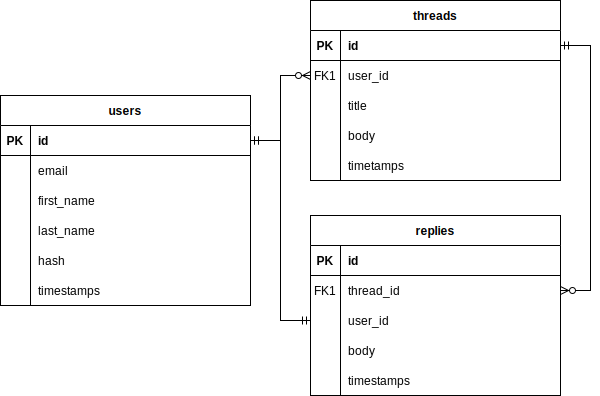

Golang REST-API forum.
====================================

This is educational purpose project, it contains threads and replies to which users can interact by REST-API.

## Requirements

- [Docker](https://www.docker.com/)
- [Docker Compose](https://docs.docker.com/compose/)

Launch steps:
* Copy .env.sample to .env and setup configs for database, ports forwarding etc.
* Build project by running ```docker-compose up```.

## Database



Database structure is migrated by gorm AutoMigrate functionality.
And then seeded on first launch, when seeds are done, the `./isSeeded` file generated
to prevent seeding on next launches.
